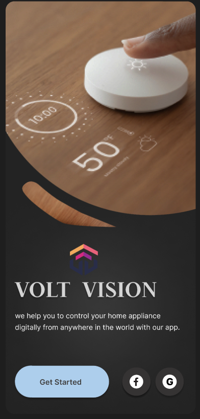
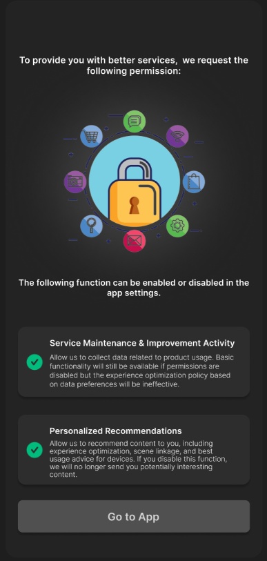
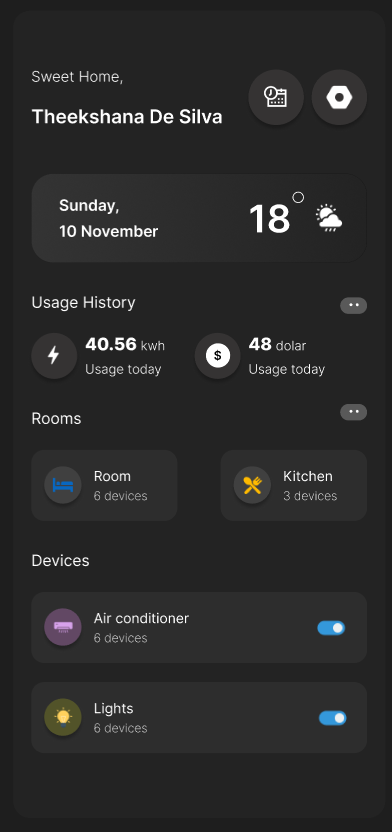
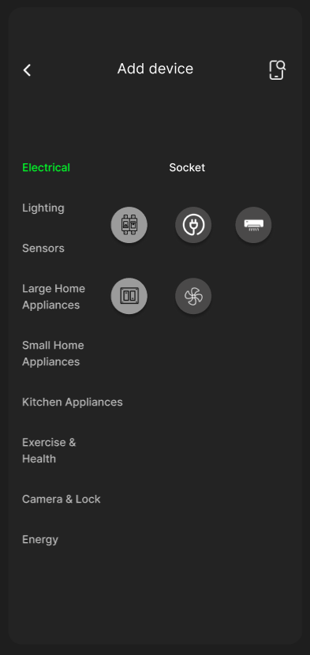
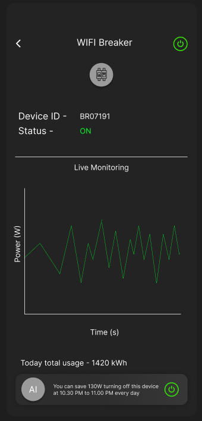
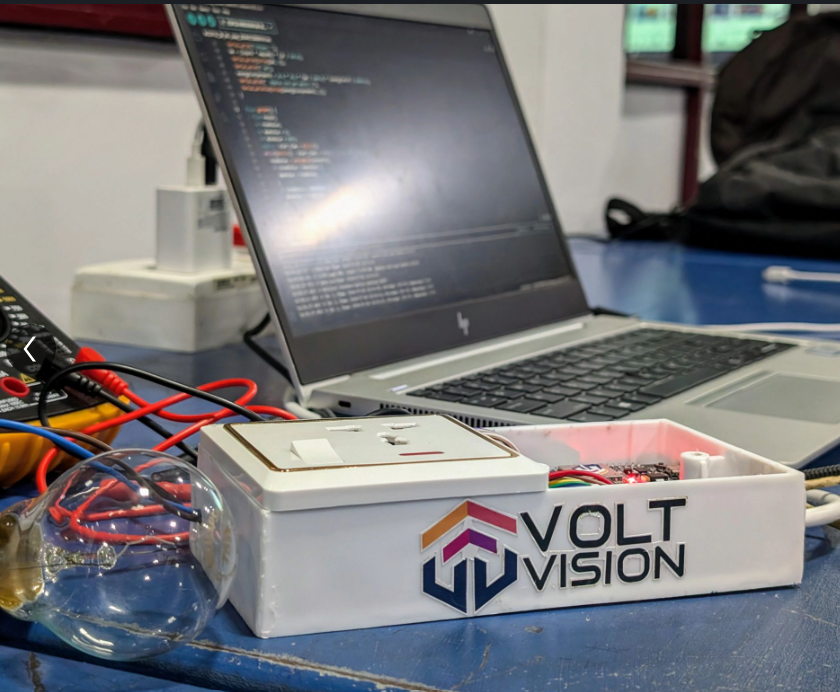

# VoltVision Smart Plug Project

Welcome to the Smart Plug Project! This project aims to revolutionize home automation by providing a smart plug that allows you to manage and monitor all your home devices efficiently through our mobile application.

## Key Features

- Device Management: Seamlessly manage all devices in your home through our smart plug.
- Live Monitoring: Check real-time current usage of each connected device via the mobile app.
                   Safety Alerts:
- Current Mismatches: Automatically shut off the smart plug to prevent electrical hazards when a mismatch is detected.
- Gas Leak Detection: Identify gas leaks and automatically turn off devices in the affected area through the smart plug.
- Cost Tracking: Calculate your monthly electricity bill based on device usage.
- AI-Powered Insights: `/n` 
        Provide daily usage data for each device.
        * Analyze data to identify the most power-hungry devices.
        * Offer suggestions to save electricity, such as optimal times to turn off specific devices.

### Frontend
    ✅ Flutter ✅ Dart

### BackEnd
    ✅ Django

### Arduino
    ✅ C++

